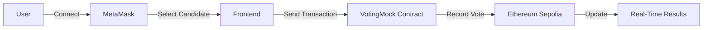
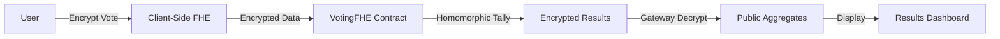

<div align="center">

# 🗳️ ZamaVote

### Confidential On-Chain Voting with Fully Homomorphic Encryption

[](https://nextjs.org/)
[](https://www.typescriptlang.org/)
[](https://soliditylang.org/)
[](https://ethereum.org/)
[](https://www.zama.ai/)

[Live Demo]() • [Smart Contract](https://sepolia.etherscan.io/address/0x5d36BcD10379dAEBCa1B05f0da35c122010c2bcB) • [Documentation](#-documentation)

---

</div>

## 📖 About

**ZamaVote** is a decentralized voting application that demonstrates how **Fully Homomorphic Encryption (FHE)** can enable truly confidential on-chain voting. Unlike traditional blockchain voting where votes are publicly visible, ZamaVote ensures that individual votes remain encrypted and private while still allowing transparent tallying of results.

### 🎯 Key Features

- ✅ **Fully Confidential Voting** - Votes encrypted using FHE technology
- 🔐 **Zero-Knowledge Results** - Aggregate results without revealing individual votes
- 🚫 **Double-Vote Prevention** - On-chain enforcement prevents voting twice
- 🎯 **Vote Tracking** - See which candidate you voted for with visual feedback
- ⚡ **Real-Time Tallying** - Live results update every 5 seconds
- 🎨 **Premium Dark UI** - Glassmorphism design with custom SVG icons
- 🌐 **Multi-Session Support** - Multiple concurrent voting sessions with time limits
- 🔔 **No Popups** - Clean inline notifications, no annoying alerts
- 🌈 **Custom Icons** - Beautiful gradient SVG icons throughout
- 🌑 **Dark Theme** - Sophisticated midnight blue color palette
- 🌐 **Blockchain-Powered** - Deployed on Ethereum Sepolia testnet

---

## 🏗️ Architecture

### Current Implementation (Mock)

The application currently uses a **mock voting contract** for demonstration and testing:

| Component | Technology | Details |
|-----------|-----------|---------|
| **Smart Contract** | Solidity 0.8.24 | `VotingMock.sol` - Multi-session voting logic |
| **Deployed Address** | Sepolia Testnet | `0x5d36BcD10379dAEBCa1B05f0da35c122010c2bcB` |
| **Frontend** | Next.js 15 + TypeScript | Modern React with App Router |
| **Styling** | Tailwind CSS 3.4 | Responsive, utility-first design |
| **Blockchain** | Ethereum Sepolia | Testnet deployment |

### FHE Production Version

The repository includes a **complete FHE implementation** (`VotingFHE.sol`) ready for production:

- 🔒 **Client-Side Encryption** - Votes encrypted before submission
- 🧮 **Homomorphic Tallying** - Vote counting without decryption
- 🔑 **Zama Gateway** - Authorized decryption for final results
- 📦 **Reference Code** - Commented integration in frontend

---

## 🚀 Quick Start

### Prerequisites

Before you begin, ensure you have the following installed:

- **Node.js** (v18 or higher) - [Download](https://nodejs.org/)
- **MetaMask** browser extension - [Install](https://metamask.io/)
- **Sepolia ETH** for gas fees - [Get from faucet](https://sepoliafaucet.com/)

### Installation

1. **Clone the repository**
   ```bash
   git clone https://github.com/yourusername/zamavote.git
   cd zamavote
   ```

2. **Install dependencies**
   ```bash
   npm install
   ```

3. **Configure environment**

   Create a `.env` file in the root directory:
   ```env
   SEPOLIA_RPC_URL="https://sepolia.infura.io/v3/YOUR_INFURA_KEY"
   PRIVATE_KEY="your_wallet_private_key_here"
   ```

### Running the Application

```bash
# Start the development server
npm run dev

# Open http://localhost:3000 in your browser
```

### Using the DApp

1. **Connect Wallet**
   - Click "Connect Wallet" button
   - Approve the MetaMask connection
   - Ensure you're on Sepolia testnet

2. **Cast Your Vote**
   - Choose from Bitcoin, Ethereum, or Solana
   - Click "Vote for [Candidate]"
   - Confirm the transaction in MetaMask
   - Wait for confirmation

3. **View Results**
   - Results update in real-time
   - See vote counts and percentages
   - Once voted, buttons are disabled

### Testing with Scripts

Cast automated test votes using the included script:

```bash
npm run cast-votes
```

> **💡 Tip**: To cast multiple test votes from different addresses, use the frontend with different MetaMask accounts.

## 📁 Project Structure

```
zamavote/
├── 📱 Frontend (Next.js)
│   ├── app/
│   │   ├── page.tsx              # Main voting interface
│   │   ├── layout.tsx            # Root layout with metadata
│   │   └── globals.css           # Global Tailwind styles
│   ├── components/
│   │   ├── Header.tsx            # App header
│   │   ├── Footer.tsx            # App footer
│   │   ├── ConnectWallet.tsx     # Wallet connection UI
│   │   ├── Voting.tsx            # Voting interface
│   │   └── Results.tsx           # Live results display
│   └── utils/
│       └── fhe.ts                # FHE utilities (reference)
│
├── 📜 Smart Contracts
│   ├── VotingMock.sol            # Current: Mock implementation
│   └── VotingFHE.sol             # Production: FHE implementation
│
├── 🛠️ Scripts & Config
│   ├── test/
│   │   └── vote.mjs    # Automated testing script for voting
│   │   └── create-vote.mjs    # Automated testing script for creating vote
│   ├── ignition/modules/
│   │   └── deploy.cjs            # Contract deployment
│   ├── hardhat.config.cjs        # Hardhat configuration
│   ├── next.config.ts            # Next.js configuration
│   ├── tailwind.config.ts        # Tailwind CSS config
│   └── tsconfig.json             # TypeScript config
│
└── 📄 Documentation
    └── README.md                 # This file
```

---

## 🔐 Enabling FHE (Production Mode)

The repository includes a complete FHE implementation. To switch from mock to production:

### Step 1: Deploy FHE Contract

```bash
# The FHE contract is already compiled at contracts/VotingFHE.sol, but now we are using contracts/Voting.sol
# Deploy it to Sepolia deploy
npm run deploy
```

### Step 2: Update Frontend

In `app/page.tsx`:

```typescript
// Line 34-37: Uncomment FHE initialization
useEffect(() => {
  import("@/utils/fhe").then(({ initFhevm }) => {
    initFhevm().catch(console.error);
  });
}, []);

// Line 111-116: Uncomment encryption logic
const { encryptVote } = await import("@/utils/fhe");
const encryptedVoteData = await encryptVote(candidateIndex);
// Send encryptedVoteData to contract
```

### Step 3: Update Contract Details

```typescript
// Update contract address
const contractAddress = "YOUR_FHE_CONTRACT_ADDRESS";

// Update ABI for FHE contract
const contractABI = [
  "function vote(einput encryptedVote, bytes calldata inputProof)",
  // ... other FHE functions
];
```

---

## 🛠️ Available Scripts

| Command | Description |
|---------|-------------|
| `npm run dev` | Start Next.js development server |
| `npm run build` | Build application for production |
| `npm run start` | Start production server |
| `npm run lint` | Run ESLint code linting |
| `npm run compile` | Compile Solidity contracts |
| `npm run test` | Run Hardhat contract tests |
| `npm run deploy:sepolia` | Deploy contract to Sepolia |
| `npm run cast-votes` | Cast automated test votes |

---

## 🔑 How It Works

<details>
<summary><b>Mock Implementation (Current)</b></summary>



1. **Connect Wallet** - User connects MetaMask to the dApp
2. **Choose Candidate** - Select from Bitcoin, Ethereum, or Solana
3. **Submit Vote** - Transaction sent to smart contract
4. **On-Chain Recording** - Vote recorded publicly on blockchain
5. **Live Updates** - Results displayed in real-time

</details>

<details>
<summary><b>FHE Implementation (Production Ready)</b></summary>



1. **Vote Encryption** - Vote encrypted on client using FHE
2. **Submit Ciphertext** - Encrypted vote sent to FHEVM contract
3. **Homomorphic Tallying** - Contract counts without decrypting
4. **Authorized Decryption** - Only aggregates revealed via gateway
5. **Public Results** - Final counts displayed, votes stay private

</details>

---

## 📚 Technology Stack

### Frontend
- **Framework**: [Next.js 15.5.4](https://nextjs.org/) - React framework with App Router
- **Language**: [TypeScript 5.0](https://www.typescriptlang.org/) - Type-safe JavaScript
- **Styling**: [Tailwind CSS 3.4](https://tailwindcss.com/) - Utility-first CSS
- **State Management**: React Hooks (useState, useEffect)

### Blockchain
- **Smart Contracts**: [Solidity 0.8.24](https://soliditylang.org/)
- **Development**: [Hardhat](https://hardhat.org/) - Ethereum development environment
- **Web3 Library**: [Ethers.js 6.15](https://docs.ethers.org/v6/) - Blockchain interaction
- **Network**: [Ethereum Sepolia](https://sepolia.dev/) - Testnet deployment

### Encryption
- **FHE Library**: [Zama FHEVM](https://docs.zama.ai/fhevm) - Fully Homomorphic Encryption
- **SDK**: `@zama-fhe/relayer-sdk` - Client-side encryption tools
- **Gateway**: Zama Gateway - Authorized decryption service

---

## 🌐 Deployed Contract

### Mock Contract (Current)

| Property | Value |
|----------|-------|
| **Network** | Ethereum Sepolia Testnet |
| **Address** | [`0x5d36BcD10379dAEBCa1B05f0da35c122010c2bcB`](https://sepolia.etherscan.io/address/0x5d36BcD10379dAEBCa1B05f0da35c122010c2bcB) |
| **Contract** | `VotingMock.sol` (Multi-Session) |
| **Candidates** | Bitcoin, Ethereum, Solana |
| **Features** | Multi-session support, Time limits, Vote tracking, Double-vote prevention |

### FHE Contract (Production Ready)

| Property | Value |
|----------|-------|
| **Contract** | `VotingFHE.sol` |
| **Status** | ✅ Compiled, Not Deployed |
| **Features** | FHE encryption, Homomorphic tallying, Gateway decryption |

---

## 🔒 Security Features

### Smart Contract Level
- ✅ **Double-Vote Prevention** - Mapping tracks voted addresses
- ✅ **Input Validation** - Candidate index bounds checking
- ✅ **Access Control** - User-specific vote retrieval
- ✅ **Reentrancy Protection** - No external calls in vote function

### Frontend Level
- ✅ **UI State Management** - Disables voting after confirmation
- ✅ **Transaction Verification** - Checks vote status on-chain
- ✅ **Error Handling** - Graceful failure with user feedback
- ✅ **Type Safety** - Full TypeScript implementation

### FHE Security (Production)
- 🔐 **Client-Side Encryption** - Votes never leave device unencrypted
- 🔐 **Zero-Knowledge Tallying** - Contract computes on ciphertexts
- 🔐 **Authorized Decryption** - Only gateway can decrypt aggregates
- 🔐 **Privacy Preservation** - Individual votes permanently encrypted

---

## 📖 Documentation

### Smart Contracts

- **VotingMock.sol** - [View Source](contracts/VotingMock.sol)
  - Mock implementation for testing
  - Standard Solidity voting logic
  - Deployed on Sepolia testnet

- **VotingFHE.sol** - [View Source](contracts/VotingFHE.sol)
  - Production FHE implementation
  - Uses Zama TFHE library
  - Homomorphic vote tallying

### Frontend Integration

- **Vote Submission** - [app/page.tsx](app/page.tsx)
- **UI Components** - [components/](components/)
- **FHE Utils** - [utils/fhe.ts](utils/fhe.ts)

---
### Guidelines

- Follow the existing code style
- Add tests for new features
- Update documentation as needed
- Ensure all tests pass before submitting

---
